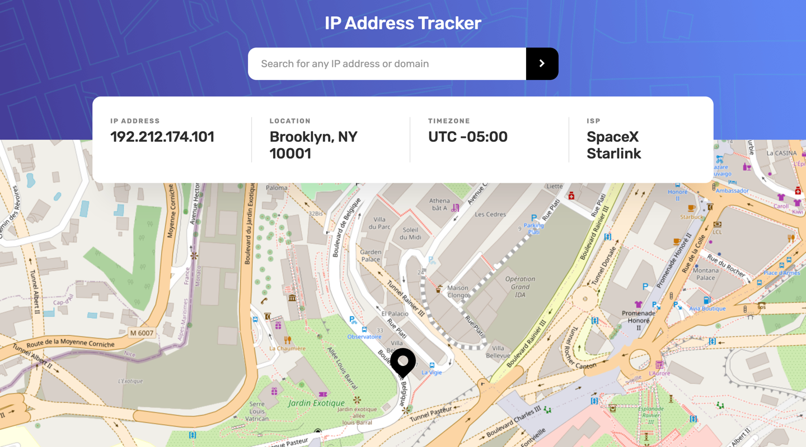
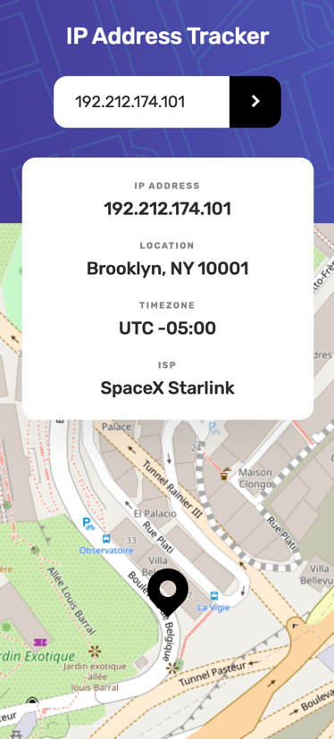

# Frontend Mentor - IP address tracker solution

This is a solution to the [IP address tracker challenge on Frontend Mentor](https://www.frontendmentor.io/challenges/ip-address-tracker-I8-0yYAH0). Frontend Mentor challenges help you improve your coding skills by building realistic projects.

## Table of contents

- [Overview](#overview)
  - [The challenge](#the-challenge)
  - [Screenshot](#screenshot)
  - [Links](#links)
- [My process](#my-process)
  - [Built with](#built-with)
- [Author](#author)

## Overview

### The challenge

Users should be able to:

- View the optimal layout for each page depending on their device's screen size
- See hover states for all interactive elements on the page
- See their own IP address on the map on the initial page load
- Search for any IP addresses or domains and see the key information and location

### Screenshot
* Desktop

* Mobile

### Links

- Solution URL: [IP Address Tracker using NextJS](https://www.frontendmentor.io/solutions/ip-address-tracker-using-nextjs-Q2l3E5R4K)
- Live Site URL: [IP Address Tracker](https://ip-address-tracker-hanseonglee.vercel.app)

## My process

### Built with

- Semantic HTML5 markup
- Flexbox
- CSS Grid
- Mobile-first workflow
- [React](https://reactjs.org/) - JS library
- [Next.js](https://nextjs.org/) - React framework
- [Sass/SCSS](https://sass-lang.com/) - For styles
- [ipify](https://geo.ipify.org/) - Geo IP API
- [JSON Test](http://ip.jsontest.com/) - Retuning current IP
- [Leaflet API](https://leafletjs.com/) - An open-source JavaScript libarary for mobile-friendly interactive maps

### Useful resources

- [IP Geolocation API Docs](https://geo.ipify.org/docs) - This helped me to understand IP Geolocation APIs.
- [Leaflet API Reference](https://leafletjs.com/reference.html) - This helped me to understand Leaflet APIs.
- [RegEx Testing - IP and URL validator](https://www.regextester.com/99895) - This helped me for IP and URL regex.

## Author

- Frontend Mentor - [@HanSeongLee](https://www.frontendmentor.io/profile/HanSeongLee)
